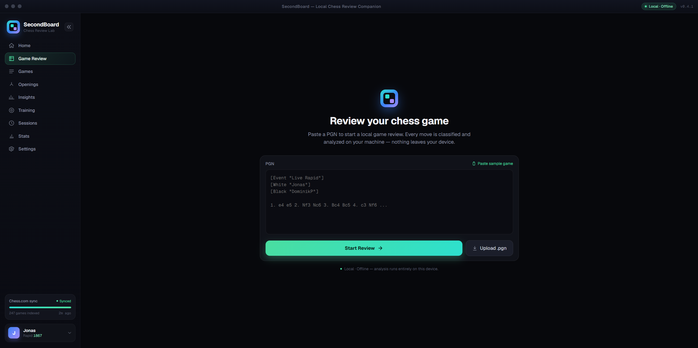
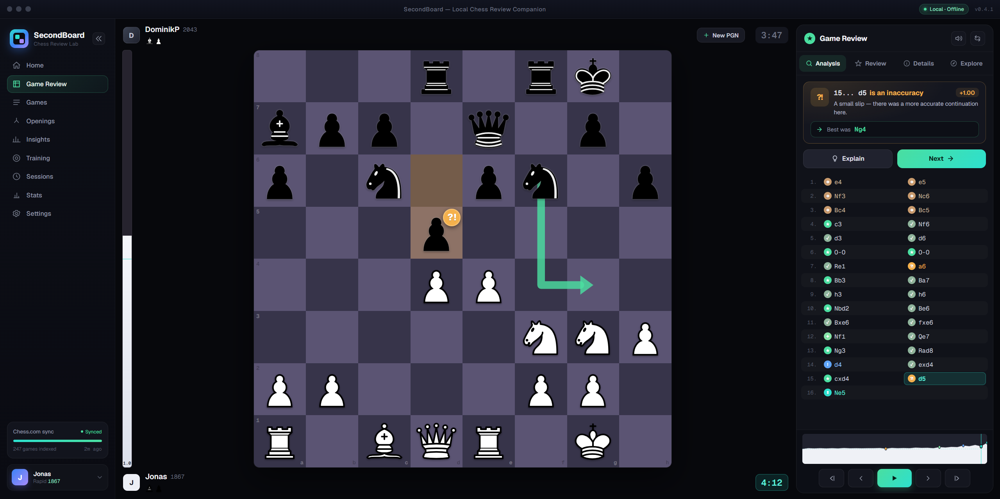
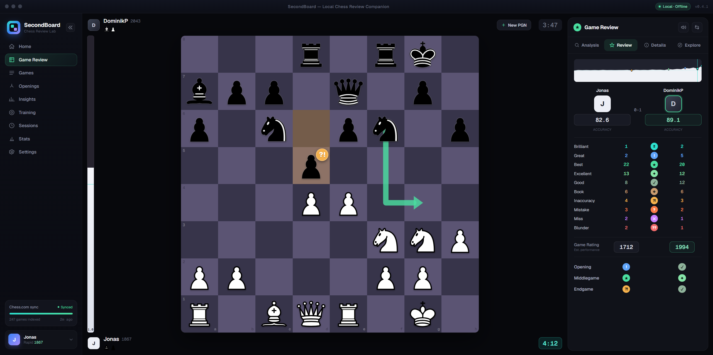

[![DeepWiki](https://img.shields.io/badge/DeepWiki-jonasyr%2FSecondBoard-blue.svg?logo=data:image/png;base64,iVBORw0KGgoAAAANSUhEUgAAACwAAAAyCAYAAAAnWDnqAAAAAXNSR0IArs4c6QAAA05JREFUaEPtmUtyEzEQhtWTQyQLHNak2AB7ZnyXZMEjXMGeK/AIi+QuHrMnbChYY7MIh8g01fJoopFb0uhhEqqcbWTp06/uv1saEDv4O3n3dV60RfP947Mm9/SQc0ICFQgzfc4CYZoTPAswgSJCCUJUnAAoRHOAUOcATwbmVLWdGoH//PB8mnKqScAhsD0kYP3j/Yt5LPQe2KvcXmGvRHcDnpxfL2zOYJ1mFwrryWTz0advv1Ut4CJgf5uhDuDj5eUcAUoahrdY/56ebRWeraTjMt/00Sh3UDtjgHtQNHwcRGOC98BJEAEymycmYcWwOprTgcB6VZ5JK5TAJ+fXGLBm3FDAmn6oPPjR4rKCAoJCal2eAiQp2x0vxTPB3ALO2CRkwmDy5WohzBDwSEFKRwPbknEggCPB/imwrycgxX2NzoMCHhPkDwqYMr9tRcP5qNrMZHkVnOjRMWwLCcr8ohBVb1OMjxLwGCvjTikrsBOiA6fNyCrm8V1rP93iVPpwaE+gO0SsWmPiXB+jikdf6SizrT5qKasx5j8ABbHpFTx+vFXp9EnYQmLx02h1QTTrl6eDqxLnGjporxl3NL3agEvXdT0WmEost648sQOYAeJS9Q7bfUVoMGnjo4AZdUMQku50McDcMWcBPvr0SzbTAFDfvJqwLzgxwATnCgnp4wDl6Aa+Ax283gghmj+vj7feE2KBBRMW3FzOpLOADl0Isb5587h/U4gGvkt5v60Z1VLG8BhYjbzRwyQZemwAd6cCR5/XFWLYZRIMpX39AR0tjaGGiGzLVyhse5C9RKC6ai42ppWPKiBagOvaYk8lO7DajerabOZP46Lby5wKjw1HCRx7p9sVMOWGzb/vA1hwiWc6jm3MvQDTogQkiqIhJV0nBQBTU+3okKCFDy9WwferkHjtxib7t3xIUQtHxnIwtx4mpg26/HfwVNVDb4oI9RHmx5WGelRVlrtiw43zboCLaxv46AZeB3IlTkwouebTr1y2NjSpHz68WNFjHvupy3q8TFn3Hos2IAk4Ju5dCo8B3wP7VPr/FGaKiG+T+v+TQqIrOqMTL1VdWV1DdmcbO8KXBz6esmYWYKPwDL5b5FA1a0hwapHiom0r/cKaoqr+27/XcrS5UwSMbQAAAABJRU5ErkJggg==)](https://deepwiki.com/jonasyr/SecondBoard)

# SecondBoard

> Local-first chess review companion — analyze your games offline, powered by Stockfish.

SecondBoard is a desktop application that lets you paste a PGN and get a full game review: move-by-move evaluation, best-move arrows, classification badges, accuracy scores, and coach commentary. Everything runs on your machine — no accounts, no cloud, no uploads.

Built with **SvelteKit 5** (runes) + **Tauri v2** (Rust backend), using **Stockfish** for engine analysis and native PGN parsing via `pgn-reader`/`shakmaty`.

---

## Table of Contents

- [Screenshots](#screenshots)
- [Features](#features)
- [Prerequisites](#prerequisites)
- [Installation](#installation)
- [Development](#development)
- [Testing](#testing)
- [Building for Production](#building-for-production)
- [Project Structure](#project-structure)
- [Tech Stack](#tech-stack)
- [Contributing](#contributing)
- [License](#license)

---

## Screenshots

| Onboarding | Review — Analysis tab | Review — Review tab |
|---|---|---|
|  |  |  |

---

## Features

- **PGN import** — paste any PGN and parse it instantly via Rust/shakmaty
- **Stockfish analysis** — per-position eval (centipawns) and WDL scores, computed locally
- **Move classification** — Brilliant / Great / Best / Good / Inaccuracy / Mistake / Blunder badges
- **Eval graph** — SVG sparkline of the game's evaluation curve
- **Best-move arrows** — prospective best-move overlaid on the board
- **Accuracy scores** — WDL-based win% accuracy per player and phase
- **Coach commentary** — per-move coaching text explaining the classification
- **Fully offline** — no network calls during analysis; Stockfish runs in-process via Tauri

---

## Prerequisites

| Tool | Minimum version | Notes |
|---|---|---|
| [Node.js](https://nodejs.org/) | 18+ | Required for the SvelteKit frontend |
| [pnpm](https://pnpm.io/) | 9+ | `npm install -g pnpm` |
| [Rust](https://rustup.rs/) | 1.77.2+ | Install via `rustup` |
| [Tauri prerequisites](https://tauri.app/start/prerequisites/) | v2 | Platform-specific system libraries (see below) |

### Platform-specific Tauri dependencies

**Windows**: Install [WebView2](https://developer.microsoft.com/en-us/microsoft-edge/webview2/) (ships with Windows 11; installer available for Windows 10) and [Visual Studio C++ Build Tools](https://visualstudio.microsoft.com/visual-cpp-build-tools/).

**macOS**: Install Xcode Command Line Tools (`xcode-select --install`).

**Linux (Debian/Ubuntu)**:
```bash
sudo apt update
sudo apt install libwebkit2gtk-4.1-dev libssl-dev libayatana-appindicator3-dev librsvg2-dev
```

For other Linux distributions, see the [Tauri prerequisites page](https://tauri.app/start/prerequisites/).

---

## Installation

```bash
# Clone the repository
git clone https://github.com/jonasyr/SecondBoard.git
cd SecondBoard

# Install frontend dependencies
pnpm install
```

---

## Development

### Frontend only (no Tauri shell)

Runs the SvelteKit dev server in the browser. Tauri commands (`parse_pgn`, `analyze_fen`) are unavailable — use this only for pure UI work.

```bash
pnpm dev
```

### Full desktop app (recommended)

Starts both the Vite dev server and the Tauri Rust backend. Required to exercise PGN parsing and Stockfish analysis.

```bash
pnpm exec tauri dev
```

> **Note:** The first run will compile the Rust backend, which may take a minute or two.

### Recommended editor setup

- [VS Code](https://code.visualstudio.com/) with the [Svelte for VS Code](https://marketplace.visualstudio.com/items?itemName=svelte.svelte-vscode) extension and [rust-analyzer](https://marketplace.visualstudio.com/items?itemName=rust-lang.rust-analyzer) for Rust.

---

## Calibration data collection

Two independent, self-contained sub-projects support collecting more
chess.com Game Review ground truth for calibration:

- `server/ingest/` — a small Node + SQLite server for receiving captured
  games on your home LAN. See `server/ingest/README.md`.
- `extension/` — a Chrome extension that auto-captures Game Review results
  and sends them to the ingest server. See `extension/README.md`.

Neither shares tooling or dependencies with the main SvelteKit/Tauri app;
each has its own `package.json` and test suite.

---

## Testing

### Frontend (Vitest)

```bash
# Watch mode (default)
pnpm test

# Single run (CI)
pnpm test -- run

# Target one file
pnpm exec vitest run src/lib/components/EvalBar.test.ts
```

### Type checking

```bash
pnpm check
```

### Linting

```bash
pnpm lint
```

### Rust backend

```bash
cd src-tauri
cargo test
cargo check   # fast compile check without running tests
```

---

## Building for Production

```bash
# Build the SvelteKit frontend (static output)
pnpm build

# Build the full desktop app (frontend + Rust, packaged as installer)
pnpm exec tauri build
```

The packaged installer is placed under `src-tauri/target/release/bundle/`.

---

## Project Structure

```
SecondBoard/
├── src/
│   ├── routes/                   # SvelteKit shell (+layout.svelte, +page.svelte)
│   └── lib/
│       ├── components/           # UI components (each with co-located *.test.ts)
│       ├── stores/
│       │   └── app-state.svelte.ts  # Global reactive state singleton ($state runes)
│       ├── game/
│       │   ├── review.ts         # Per-ply derivation, GameData/PlayerRowData types
│       │   ├── engine-analysis.ts   # Stockfish orchestration across positions
│       │   ├── notation.ts       # FEN/SAN helpers
│       │   └── mock-data.ts      # Sample game fixtures (gated by game.isSample)
│       ├── api/                  # Tauri invoke() wrappers (pgn, engine, window)
│       ├── board/                # Board rendering, types, geometry helpers
│       ├── charts/
│       │   └── eval-graph.ts     # SVG eval-graph math
│       └── tokens.ts             # Design tokens (colors, classification glyphs, radii)
├── src-tauri/src/
│   ├── pgn.rs                    # PGN→positions (pgn-reader + shakmaty)
│   ├── engine.rs                 # Stockfish via UCI (eval, best move, WDL)
│   └── lib.rs / main.rs          # Tauri command registration
├── design_handoff_secondboard/   # Design source of truth (specs, mockups, reference JS)
├── .superpowers/sdd/             # Spec-driven development task briefs and reports
├── AGENTS.md                     # AI agent guidance (architecture, conventions, commands)
├── CLAUDE.md                     # Redirects to AGENTS.md
└── docs/                         # Additional documentation
```

---

## Tech Stack

| Layer | Technology |
|---|---|
| Frontend framework | SvelteKit 5 (runes: `$state`, `$derived`, `$props`) |
| Desktop shell | Tauri v2 |
| Language | TypeScript (frontend), Rust (backend) |
| Build tool | Vite 8 |
| PGN parsing | `pgn-reader` + `shakmaty` (Rust) |
| Chess engine | Stockfish (via Tauri `analyze_fen` command, WDL-aware) |
| Testing | Vitest 4 + @testing-library/svelte + jsdom |
| Lint / Format | ESLint 10 (flat config) + Prettier 3 |
| Package manager | pnpm |
| Fonts | Geist Sans + Geist Mono (@fontsource) |

---

## Contributing

1. Fork the repository and create a feature branch (`git checkout -b feat/your-feature`).
2. Follow [Conventional Commits](https://www.conventionalcommits.org/) for commit messages (`feat:`, `fix:`, `refactor:`, `docs:`, `chore:`).
3. Ensure all checks pass before opening a PR:
   ```bash
   pnpm exec vitest run   # frontend tests
   pnpm check             # type check
   pnpm lint              # ESLint
   cd src-tauri && cargo test && cargo check
   ```
4. Open a pull request against `main` with a clear description of what changed and why.

---

## License

[MIT](LICENSE) © Jonas Weirauch
